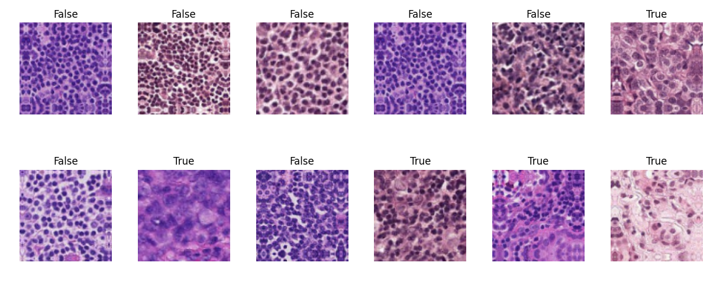
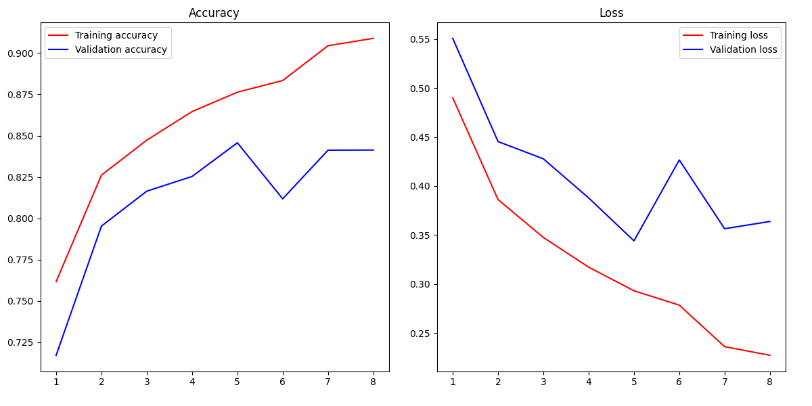
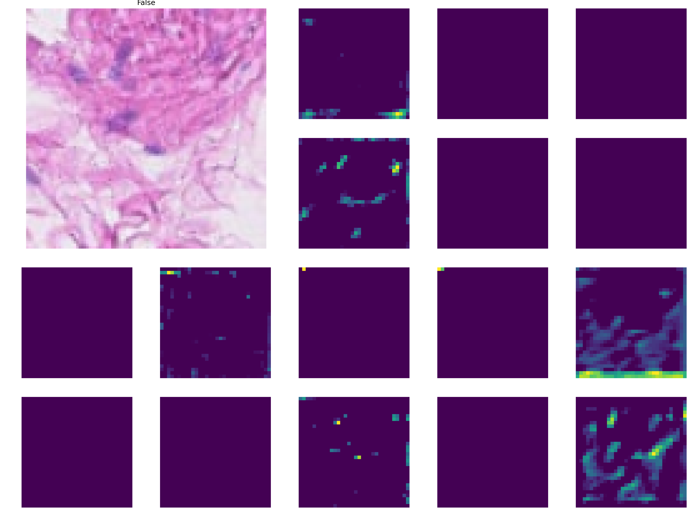

# Overview

A convolutional neural network classifier to detect metastatic tissue in histology sections, trained against the CAMELYON16 dataset.

from [TensorFlow](https://www.tensorflow.org/datasets/catalog/patch_camelyon): 

"The PatchCamelyon benchmark is a new and challenging image classification dataset. It consists of 327.680 color images (96 x 96px) extracted from histopathologic scans of lymph node sections." 

Each image is annoted with a binary label indicating presence of metastatic tissue in the centre 32x32 pixels of that image.

#
# Usage

Run via core.py

Parameters are controlled by config.yaml in the package root direcoty

#
# Method

- helper fuctions are used to initialise the package environment 
  - utils.initiatise()

- data is loaded via tfds
- data is batched, normalised and augmentations are applied (eg. rotation)
  - utils.datainit()

- a subset of images from the dataset may be displayed for inspection
  - vis.preplot

  
   

- the model is built
    - model architecture can be set to several preset options, including several simple multilayer CNNs, as well as one based on transfer learning (ResNet50)
    - tfmodel.build()

- the selected model is trained against the train set
    - a progress plot is displayed showing train and val loss
    - training is stopped when a plateau becomes apparent in val loss, to prevent overfitting
    - crossval accuracy of 0.75-0.85 is generally achieved, dependent on model chosen
    - tfmodel.train()

  
   

- finally, a subset of filters for a single random image are displayed for inspection
    - vis.layerplot()

  
   

#

